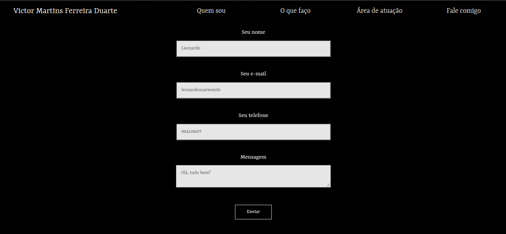
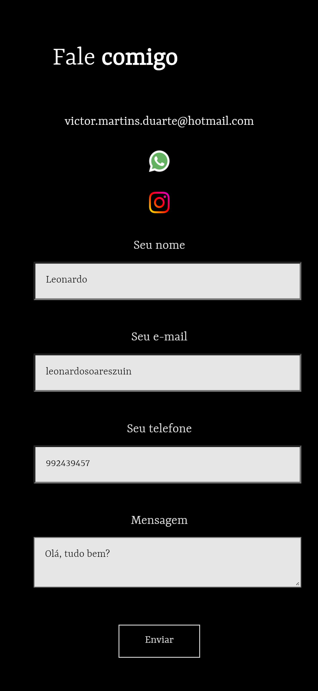

# Website profissional para o advogado Drº Victor Martins Ferreira Duarte

Este projeto foi construído com o objetivo de incremento ao portfólio e todos os envolvidos estão cientes e de acordo com a divulgação de seu 
código-fonte.

> Este *website* foi hospedado no Heroku.
> Quer verificar como ficou? Cheque [aqui](https://victor-martins.herokuapp.com/)

## Ambiente *Front End*
Foi utilizado o <code>React</code> para o desenvolvimento do *Front End* da aplicação, que funciona como uma *single-page* baseada em componentes 
funcionais e de classe.
Além do <code>React</code>, claro, foi feito uso do <code>HTML5</code> e <code>CSS</code>. 
O *website* funciona de forma responsiva (cheque *screenshots* no fim da página).

## Ambiente *Back End*
A manipulação de dados da aplicação foi feita com o Node.js usando as seguintes dependências:
* Express;
* Body Parser (json);
* CORS;
* Consign;
* Sendmail;
* Email-validator.

A única funcionalidade do *back end*, disponível na rota <code>/sendMail</code> é a de enviar mensagens deixadas pelos visitantes diretamente 
para o e-mail do cliente em questão.

## *Screenshots*
### No *Desktop*

### No *smartphone*

